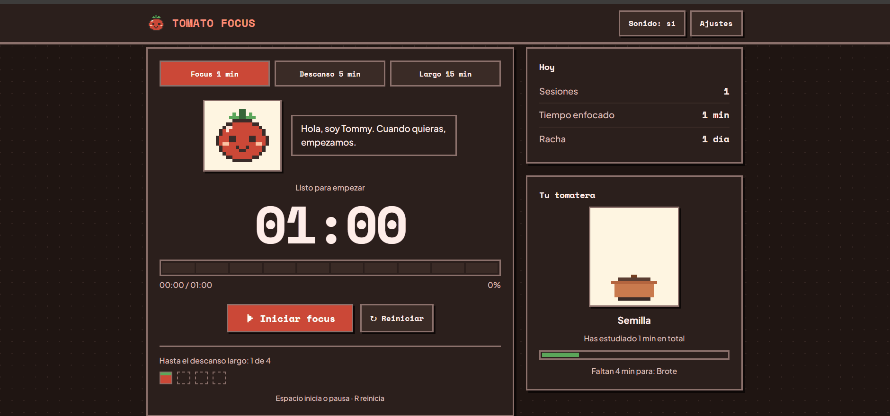
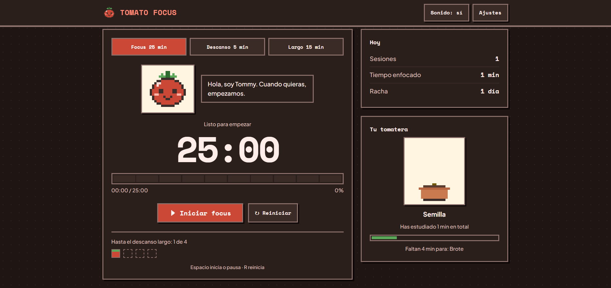
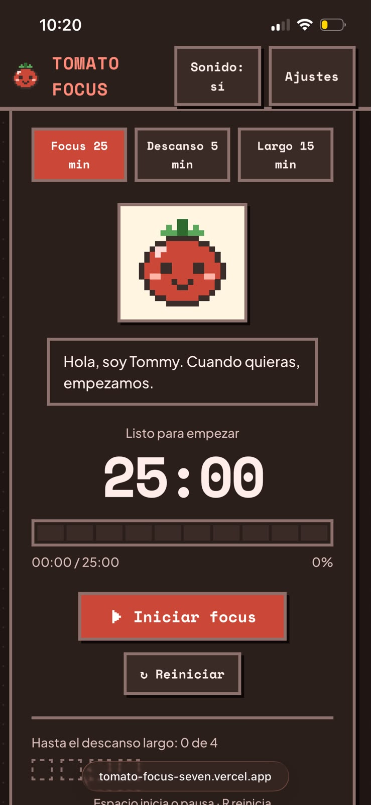

# Tomato Focus
 
Temporizador Pomodoro con estética pixel art y retro. Tommy, un tomate cute, te acompaña, y una tomatera crece según el tiempo que llevas estudiando.
 
**Demo en vivo:** https://tomato-focus-seven.vercel.app/
 

 
> Proyecto creado con inteligencia artificial: el diseño con **Google Stitch** y el código con **Claude** (Anthropic). Ver [Cómo se hizo](#cómo-se-hizo).
 
## Features
 
- Temporizador Focus, descanso corto y descanso largo (iniciar, pausar, reanudar y reiniciar)
- Cambio automático de modo y auto-inicio opcional de descansos y focus
- Ajustes de duraciones y de sesiones antes del descanso largo, con validación
- Estadísticas del día (sesiones y tiempo enfocado) y racha de días
- Tommy reacciona al estado: listo, enfocado, en pausa, descanso y celebrando
- Tomatera que crece con el tiempo de estudio acumulado (6 etapas)
- Sonido opcional al terminar la sesión (solo tras interacción del usuario)
- Atajos: `Espacio` inicia o pausa, `R` reinicia
- Responsive, modo oscuro automático y accesible por teclado
## Tech Stack
 
HTML, CSS y JavaScript puro. Sin dependencias ni paso de build. Tipografías de Google Fonts (Space Mono y Plus Jakarta Sans).
 
## Architecture
 
```
index.html   Estructura y componentes
styles.css   Tokens de color (claro/oscuro) y estilos
app.js       Estado, temporizador, ajustes, estadísticas, Tommy y tomatera
```
 
El temporizador guarda la hora objetivo y calcula el tiempo restante con `objetivo - ahora`, por eso no se desfasa si la pestaña pierde foco o se recarga.
 
## Installation
 
```bash
git clone https://github.com/<tu-usuario>/tomato-focus.git
cd tomato-focus
```
 
## Running locally
 
Abre `index.html` en el navegador, o sirve la carpeta:
 
```bash
npx serve .
# o
python3 -m http.server 8000
```
 
## Configuration
 
Todo se configura desde el botón **Ajustes** y se guarda en `localStorage`:
 
| Opción | Rango | Por defecto |
| --- | --- | --- |
| Focus | 1–120 min | 25 |
| Descanso corto | 1–60 min | 5 |
| Descanso largo | 1–120 min | 15 |
| Sesiones antes del descanso largo | 1–12 | 4 |
 
Claves usadas en `localStorage`: `tf.settings`, `tf.timer`, `tf.stats`.
 
Limitación conocida: con varias pestañas abiertas se sincronizan por `localStorage`, pero si dos terminan la misma sesión en el mismo instante podría contarse doble.
 
## Screenshots
 
| Escritorio | Móvil |
| --- | --- |
|  |  |
 
## Cómo se hizo
 
Este proyecto es un experimento de desarrollo asistido por inteligencia artificial:
 
- **Diseño:** el diseño preliminar de la interfaz (estética pixel art cozy, paleta, tipografías y componentes) fue generado con **Google Stitch**.
- **Código:** la lógica en JavaScript (temporizador, ajustes, estadísticas, Tommy y la tomatera) fue desarrollada con **Claude**, de Anthropic, a partir de ese diseño y de las indicaciones del autor.
- **Dirección:** el autor definió los requisitos, revisó los resultados y decide los ajustes de cada iteración.
## Future Improvements
 
- Notificaciones del navegador y PWA
- Estadísticas históricas
- Logros y distintas mascotas o temas
- Sonidos personalizados
- Cuentas y sincronización en la nube
## License
 
MIT. Ver [LICENSE](LICENSE).
 
